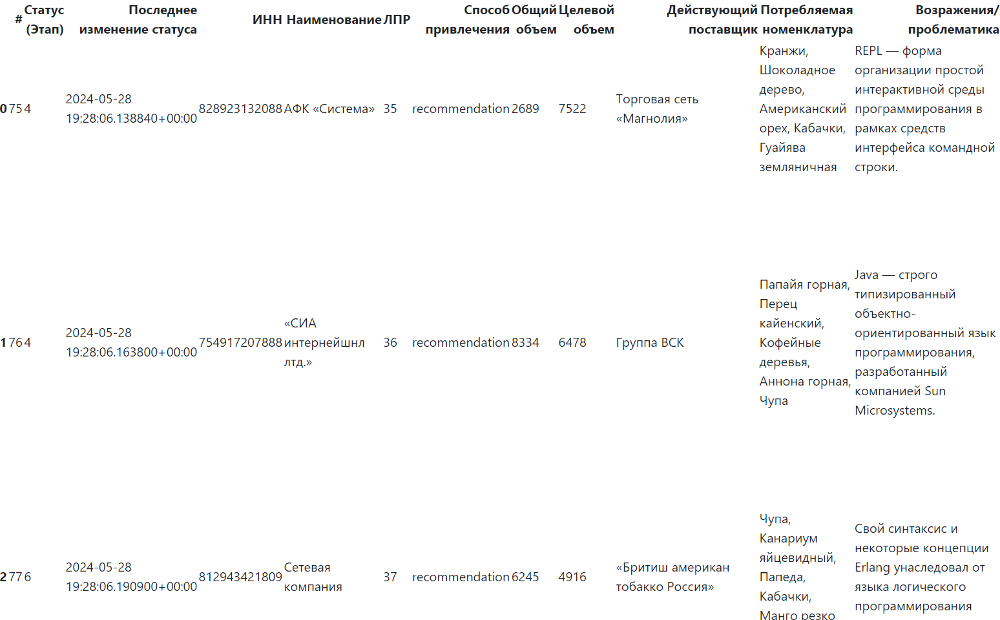
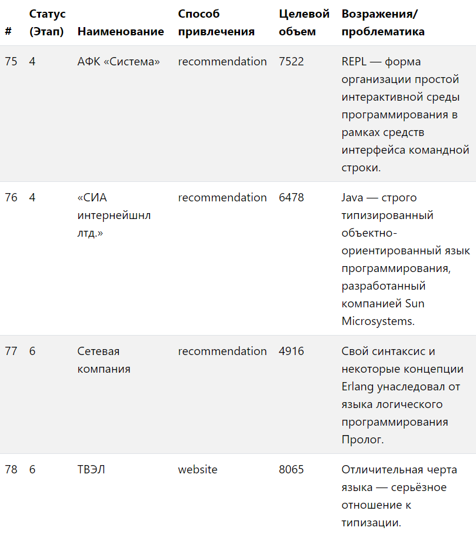

# Pandas НЕ для анализа данных

## Введение

В среде питонистов библиотека Pandas пользуется большой популярностью и по большей мере известна в контексте DataSciense и анализа данных, как инструмент для работы с большими объемами данных. Как следует из русскоязычной википедии: "**pandas** — это программная библиотека на языке Python для обработки и анализа данных." Наверное не один Jupyter ноутбук не обходится без использования пандосовских DataFrame'ов. На самом деле, DataFrame пандас позволяет не только всячески манипулировать данными, но и выводить их в нужном формате, предоставляя широкие возможности для кастомизации. Например, использовали ли вы объекты класса `Styler` входящего в состав Pandas? Мне показалось интересным взлянуть на Pandas с этой стороны.

На практике очень многие бизнес-задачи подразумевают работу с двумерными массивами данных или проще говоря - таблицами. Как следствие, возникает потребность представлять такие данные в виде удобном для восприятия человеком. Поэтому будет интерсено поговорить о подходах к рендеренгу таблиц в контексте веб-приложения на Python.

Актуальности данной теме добавляет тот факт, что подобной информации довольно мало как в интернете, так и в профессиональной литературе (возможность рендеринга таблиц в html не упоминается и в указанной выше [статье](https://ru.wikipedia.org/wiki/Pandas) википедии).

## Проблема

Мы хотим отображать имеющиеся данные в виде html таблицы.

Часто одни и те же данные нужно представить в разных вариациях, например отобразить на странице сайта, в email сообщении или формате Excel. Когда я начинал работу над одним из прошлых проектов, я столкнулся с трудно-поддерживаемыми, толстыми шаблонами веб-страниц, которые содержали html разметку для отображения таблиц с большим количеством данных. К тому же, html шаблоны могли иметь различные вариации например для email уведомлений и тд. Такой подход вызывает трудности при изменении структуры таблицы или данных.

*Все последующие манипуляции будем проводить в контексте приложения на Django. В качестве адаптера БД имеется модель `Customer`, в качестве http представления имеем - `CustomerListView`.
Код проекта с начальными условиями доступен на GitHub - [commit# 8fdf785](https://github.com/kosdmit/pandas_as_table_renderer/tree/8fdf785e0e715329d7390cae17c68b23cf8562a0).*

Решение в лоб - передать в контекст страницы итерируемый объект содержащий строки данных, и средствами шаблонизатора итерироваться по нему формируя html код таблицы строка за строкой.

✅ Не требует использования дополнительных библиотек
❌ "Толстые" шаблоны таблиц
❌ Затруднена поддержка и внесение изменений
❌ Повторение работы при необходимости добавить вариацию таблицы (email, Excel и тд.)

## Используем DataFrame

Поскольку pandas уже входил в технологический стек проекта, было принято решение задействовать эту библиотеку для рендеринга таблиц в html.

DataFrame это внутренняя структура Pandas для хранения таблицы и проведения операций над ней. Создадим новый объект DataFrame, передав нужные данные в конструктор класса, и отрендерим html воспользовавшись методом датафрейма - `to_html()`:

```python
# views.py

class CustomerListView(ListView):
    model = Customer
    paginate_by = 10

    def get_context_data(self, *, object_list=None, **kwargs):
        context = super().get_context_data(**kwargs)
        context['table'] = self.get_html_table(context['object_list'])
        return context

    def get_html_table(self, object_list: QuerySet):
        df = pd.DataFrame(
            data=object_list.values_list(),
            columns=[field.verbose_name for field in object_list.model._meta.get_fields()],
        )
        return df.to_html()
```

Метод `get_html_table()` возвращает html код таблицы принимая на вход объект типа QuerySet - `object_list` из контекcта ListView Django.

Конструктор класса DataFrame может принимать итерируемый объект который содержит входные данные и список наименований столбцов.
Поэтому передаем данные в DataFrame воспользовавшись методом QuerySet.values_list() для представления объектов БД в виде кортежей со значениями атрибутов объекта.

Таким образом, мы получили html таблицу написав миниатюрный метод состоящий из нескольких строк кода. Хотя, стоит отметить, что в таком виде таблица не будет иметь какой либо стилизации. Убедимся в этом добавив полученный html в шаблон страницы, и взглянем на неё:

```html
# customer_list.html




  <div class="col-6">
    {{ table|safe }}
  </div>

```



*Код проекта из этого раздела доступен на GitHub - [commit# 2005e31](https://github.com/kosdmit/pandas_as_table_renderer/tree/2005e31e9314ce67bda388aca7240ac85474d8d9).*

## Используем средства стилизации

На самом деле метод `DataFrame.to_html` может принимать определенный перечень аргументов для обеспечения удобочитаемости таблицы на выходе. Например можно настроить ширину границ ячеек, отображение индекса, заполнение пустых ячеек, выравнивание наименований столбцов и т.д. (с полным перечнем возможностей можно ознакомиться на соответсвующей странице в [документации](https://pandas.pydata.org/docs/reference/api/pandas.DataFrame.to_html.html)).

```python
# views.py
# def get_html_table(queryset):

return df.to_html(
            classes='table table-striped table-hover',
            border=0,
            index=False,
            na_rep='-',
            justify='left',
            columns=(
                Customer.id.field.verbose_name,
                Customer.status.field.verbose_name,
                Customer.name.field.verbose_name,
                Customer.source.field.verbose_name,
                Customer.target_volume.field.verbose_name,
                Customer.problematic.field.verbose_name,
            ),
        )
```

Аргумент `columns` определяет отображаемые столбцы таблицы, таким образом можно использовать один экземпляр DataFrame в различных сценариях вывода, когда требуется ограничить количество отображаемой информации (например для отправки таблицы в email).

С помощью аргумента `classes` можно оперделять css классы html элемента `<table>` и гибко управлять отображением таблицы с помощью css-правил. В приведенном примере я использую готовые стили css-библиотеки Bootstrap 5 для быстрой стилизации таблицы. Таким образом можжно получить результат соотвтветсвующий стилю вашего проекта.



✅ Логика рендеринга объектов инкапсулирется в соответствующие классы
✅ Возможность изменения структуры таблиц без редактирования html шаблонов
❌ Ограниченные возможности контроля рендеринга html

*Код проекта из этого раздела доступен на GitHub - [commit# 8108dd0](https://github.com/kosdmit/pandas_as_table_renderer/tree/8108dd08aa063fca0ae7b1b7eb9e70416357704a).*

## Используем Styler

В предыдущем разделе мы получили html код который можно использовать например для отображения таблиц в email письмах. Но чаще всего задачи разработки требуют более широкого контроля над процессом server-side рендеринга.

Класс Styler - это интрумент для гибкого контроля над процессом экспорта струтур данных Pandas в различные сторонние форматы. Помимо рендеринга html, класс Styler позволяет экспортировать данные в формат Excel и др. Это весьма удобно, ведь в практике автоматизации бизнес-задач, часто необходима возможность представления данных как в html так и формате xlsx и др.

```python
# views.py
# class CustomerListView(ListView):

def get_html_table(queryset: QuerySet) -> str:
    df = pd.DataFrame(
        data=queryset.values_list(),
        columns=[field.verbose_name for field in queryset.model._meta.get_fields()],
    )

    columns = ('id', 'status', 'name', 'source', 'target_volume', 'problematic')  # Список отображаемых столбцов

    styler = Styler(df)
    styler.format(na_rep='-')
    styler.hide(axis='index')
    styler.hide(
        subset=[field.verbose_name for field in Customer._meta.get_fields() if field.name not in columns],
        axis='columns',
    )

    return styler.to_html(table_attributes='class="table table-striped table-hover"')
```

Обновленный метод возвращает идентичную таблицу, но предствляется немного более сложным по сравнению с тем, что мы использовали ранее. Не смотря на это, такой вариант является более предпочтительным, т.к. дает намного больше возможностей контроля, в чем мы убедимся далее.

Контруктор класса Styler принимает в качестве обязательного аргумента DataFrame Pandas. После инициалзации объект класса предоставляет широкий набор интрументов стилизации:

* `Styler.format()` - используется для форматирования значений в ячейках, например задать способ отображения пустых ячеек.
* `Styler.hide()`  - позволяет убирать из контекста рендеринга определенные элементы исходного DataFrame'a. В нашем случае скрывается индекс и столбцы которые не входят в кортеж `columns`.
* `Styler.template_html_table` - атрибут позволяет переопредлить стандартный шаблон для рендеринга html. В качетсве шаблонизатора Pandas использует внешниюю библиотеку - популярное и функиональное решение Jinja2.

Для демонстрации общей картины возможностей инструментария Pandas я ограничился кратким перечнем. C полным перечнем методов и атрибутов класса Styler вы можете ознакомиться в соответствующем разделе [документации](https://pandas.pydata.org/docs/reference/api/pandas.io.formats.style.Styler.html).

*Код проекта из этого раздела доступен на GitHub - [commit# ](https://github.com/kosdmit/pandas_as_table_renderer/).*
